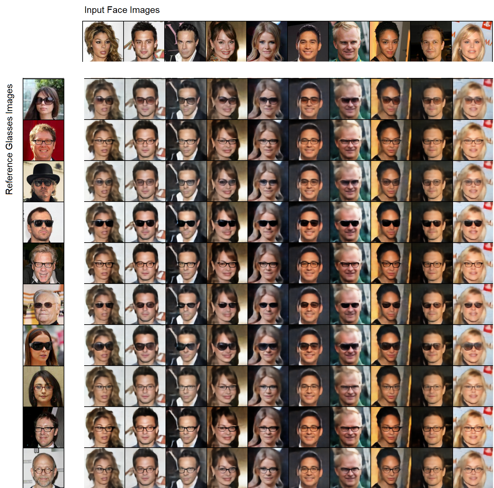
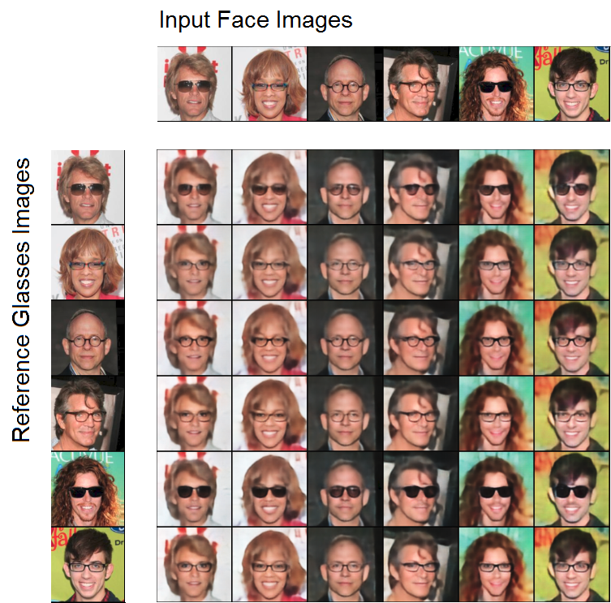

## Emerging Disentanglement in Auto-Encoder Based Unsupervised Image Content Transfer

PyTorch implementation of "Emerging Disentanglement in Auto-Encoder Based Unsupervised Image Content Transfer" ([link](https://openreview.net/pdf?id=BylE1205Fm)).


The network learns to disentangle image representations between a set and its subset. For example, given a set of faces, a subset of which have with glasses, the network
learns to decompose a face representation into 2 parts: one that contains information about glasses and one that contains information about everything else.

To accomplish this, we train a network consisting of two encoders and one decoder on the autoencoding objective. The first encoder only encodes information that has to do with the glasses in the picture, and the second encoder encodes information related to everything else. During training, we train the encoders and the decoder to reconstruct images of people with and without glasses. Then, to encode an image of a person with glasses, we run both encoders on that image and then concatenate their output. When we encode an image of a person without glasses, we just don't use the first encoder, and instead concatenate a vector of zeros to the output of the second decoder. To ensure the encodings produced by the second encoder do not contain information about glasses, we use a discriminator that tries to predict whether an encoding came from an image of a person with or without glasses.

With a trained model, we can then transfer one person's glasses to different people. In the image below, the glasses from the people in
the left column are transferred to the people in the top row.


We can also do this for people who already have glasses, i.e. we replace their glasses with another pair:


## Prerequisites
- Python 2.7 / 3.6
- Pytorch 0.4
- [argparse](https://docs.python.org/2/howto/argparse.html)
- [Pillow](https://pillow.readthedocs.io/en/5.3.x/)

## Get Started:
First, clone this repository by running:
```
git clone https://github.com/oripress/ContentDisentanglement
```
### Download and Prepare the Data
Download the dataset by running the following command:
```
bash celeba_downloader.sh
```
Contrary to the notation used in the paper, A is the larger set, for example, A is people with glasses and B is people without.
You can use the provided script ```preprocess.py``` to split celebA into the above format (with A and B based on the attribute of your choosing).
For example, you can run the script using the following command:
```
python preprocess.py --root ./img_align_celeba --attributes ./list_attr_celeba.txt --dest ./glasses_train
```
You can also use your own custom dataset, as long as it adheres to the following format:
```
root/
     trainA/
     trainB/
     testA/
     testB/
```
You can then run the preprocessing in the following manner:
```
python preprocess.py --root ./custom_dataset --dest ./custom_train --folders
```

### To Train
Run ```train.py```. You can use the following example to run:
```
python train.py --root ./glasses_data --out ./glasses_experiment --sep 25 --discweight 0.001
```

### To Resume Training
Run ```train.py```. You can use the following example to run:
```
python train.py --root ./glasses_data --out ./glasses_experiment --load ./glasses_experiment --sep 25 --discweight 0.001
```

### To Evaluate
Run ```eval.py```. You can use the following example to run:
```
python eval.py --data ./glasses_data --out ./glasses_eval --sep 25 --num_display 10
```

### Citation

If you found this work useful, please cite:
```@inproceedings{
press2018emerging,
title={Emerging Disentanglement in Auto-Encoder Based Unsupervised Image Content Transfer},
author={Ori Press and Tomer Galanti and Sagie Benaim and Lior Wolf},
booktitle={International Conference on Learning Representations},
year={2019},
url={https://openreview.net/forum?id=BylE1205Fm},
}
```

### Acknowledgements
The implementation is based on the architecture of [Fader Networks](https://github.com/facebookresearch/FaderNetworks).
Some of the code is also based on the implementations of [MUNIT](https://github.com/NVlabs/MUNIT) and [DRIT](https://github.com/HsinYingLee/DRIT), and [StarGAN](https://github.com/yunjey/StarGAN).
