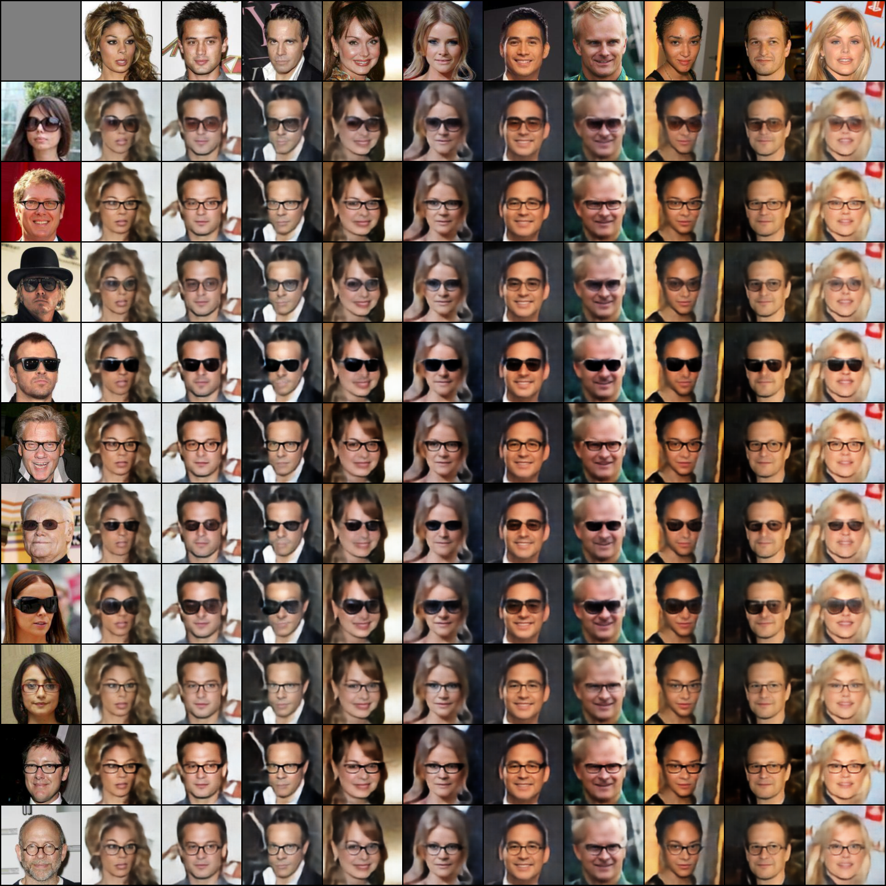

## Emerging Disentanglement in Auto-Encoder Based Unsupervised Image Content Transfer
--------------

PyTorch implementation of "Emerging Disentanglement in Auto-Encoder Based Unsupervised Image Content Transfer" ([arxiv]()). The implementation is based on the architecture of [Fader Networks](https://github.com/facebookresearch/FaderNetworks).
Some of the code is also based on the implementations of [MUNIT](https://github.com/NVlabs/MUNIT) and [DRIT](https://github.com/HsinYingLee/DRIT), and [StarGAN](https://github.com/yunjey/StarGAN).



## Prerequisites
- Python 2.7
- Pytorch 0.4
- [argparse](https://docs.python.org/2/howto/argparse.html)
- [shutil](https://docs.python.org/2/library/shutil.html)

## Get Started:
First, clone this repository by running:
```
git clone https://github.com/oripress/ContentDisentanglement
```
### Download and Prepare the Data
Download the dataset by running the following command:
```
bash celeba_downloader.sh
```

Your data directory should have the following format:
```
data/
     trainA/
     trainB/
     testA/
     testB/
```
Contrary to the paper, A is the larger set, for example, A is people with glasses and B is people without.
You can use the provided script ```preprocess.py``` to split celebA into the above format (with A and B based on the attribute of your choosing).
For example, you can run the script using the following command:
```
python preprocess.py --root './img_align_celeba' --attributes './list_attr_celeba.txt' --dest './glasses_train'
```

### To Train
Run ```train.py```. You can use the following example to run
```
python train.py --root './glasses_data' --out './glasses_experiment' --sep 25 --discweight 0.001
```

### To Evaluate
Run ```eval.py```. You can use the following example to run
```
python eval.py --dataroot './glasses_data' --out './glasses_eval' --sep 25 --num_display 10
```

